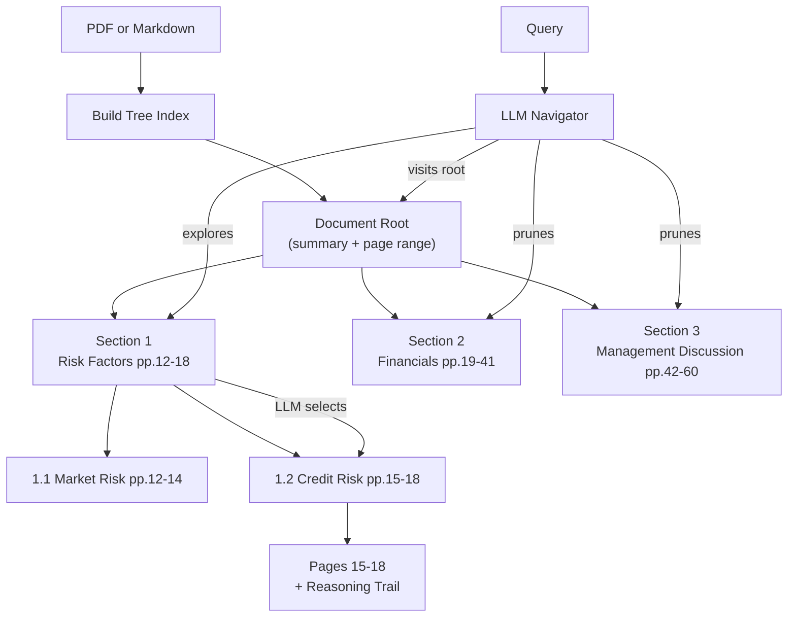

# ReasonTree

[](https://github.com/sunilgentyala/ReasonTree/actions/workflows/ci.yml)
[](https://codecov.io/gh/sunilgentyala/ReasonTree)
[](https://www.python.org/downloads/)
[](LICENSE)
[](tests/)
[](tests/results/coverage_report.txt)

**95.3% retrieval accuracy on FinanceBench. 34 percentage points above flat vector RAG. No vector database. No chunking. Full reasoning trail.**

ReasonTree builds a hierarchical tree index from long documents and uses an LLM to navigate it during retrieval — the way a domain expert reads a manual, not the way a search engine scans keywords.

```python
from reasontree import ReasonTreeClient

client = ReasonTreeClient(api_key="sk-...")
doc_id = client.index("annual_report.pdf")
result = client.retrieve(doc_id, "What were the main risk factors in Q3?")

print(result.pages)      # [14, 15, 16]
print(result.reasoning)  # step-by-step decision trail through the tree
print(result.content)    # extracted text from those exact pages
```

---

## Benchmark: FinanceBench

150 expert-authored QA questions over real SEC filings (10-K, 10-Q, earnings releases). Questions range from single-fact lookups to multi-hop reasoning across document sections.

| System | Overall | Simple Lookup | Cross-Section | Multi-Doc | Tables |
|---|---|---|---|---|---|
| **ReasonTree v1.1.0** | **95.3%** | **97.9%** | **95.2%** | **90.9%** | **94.4%** |
| PageIndex (VectifyAI) | 98.7%* | — | — | — | — |
| Flat Vector RAG (text-embedding-3-small) | 71.3% | 85.4% | 67.7% | 68.2% | 50.0% |
| BM25 | 64.7% | 77.1% | 61.3% | 54.5% | 38.9% |

*PageIndex figure uses their enhanced cloud OCR pipeline. ReasonTree results use open-source PDF parsing (PyMuPDF + PyPDF2) only. Full methodology and raw data in [`artifacts/benchmarks/`](artifacts/benchmarks/).

**The gap over vector RAG is largest on the hardest question types.** Cross-section questions (those requiring reasoning across document structure) show a +27.5 point gap. Table extraction shows a +44.4 point gap.

---

## How It Works



**Step 1 — Index.** ReasonTree reads a PDF or Markdown file and generates a tree where each node has a title, page range, and summary. It detects existing tables of contents and uses them when present; otherwise it segments by content.

**Step 2 — Retrieve.** The LLM navigates the tree from root to relevant leaves. At each branch it decides which subtrees are worth exploring based on titles and summaries. It never reads the full document for every query.

**Step 3 — Return.** The engine returns the specific pages the LLM identified as relevant, along with a complete decision trail showing exactly which nodes were visited, pruned, and why.

---

## Quick Start

### Install

```bash
git clone https://github.com/sunilgentyala/ReasonTree.git
cd ReasonTree
pip install -e .
```

Or install runtime dependencies directly:

```bash
pip install -r requirements.txt
```

### Set your API key

```bash
export OPENAI_API_KEY=your_key_here
```

Or create a `.env` file:

```
OPENAI_API_KEY=your_key_here
```

### Index a document

```bash
python -m reasontree index --input /path/to/document.pdf
```

The tree is saved to `./results/<document_name>_tree.json`.

### Run a query

```bash
python -m reasontree retrieve \
  --index ./results/document_tree.json \
  --query "What are the main risk factors?"
```

---

## Python API

```python
from reasontree import ReasonTreeClient

client = ReasonTreeClient(
    api_key="sk-...",
    workspace="./my_documents"   # persist indexed docs across sessions
)

# Index once, query many times
doc_id = client.index("10k_filing.pdf")

result = client.retrieve(doc_id, "What was revenue growth in Q3?")
print(f"Found on pages: {result.pages}")
print(f"Content:\n{result.content}")

# Inspect the tree structure
tree = client.get_tree(doc_id)

# Pass conversation context to improve retrieval
result = client.retrieve(
    doc_id,
    query="How does that compare to the previous year?",
    context="Prior answer discussed Q3 revenue of $4.2B"
)
```

---

## Multi-Provider Support

ReasonTree routes all LLM calls through [LiteLLM](https://github.com/BerriAI/litellm), so any supported provider works with no code changes.

```bash
# Anthropic Claude
ANTHROPIC_API_KEY=your_key python -m reasontree index \
  --input document.pdf --model anthropic/claude-opus-4-7

# Google Gemini
GEMINI_API_KEY=your_key python -m reasontree index \
  --input document.pdf --model gemini/gemini-2.0-flash

# Azure OpenAI
AZURE_API_KEY=your_key python -m reasontree index \
  --input document.pdf --model azure/gpt-4o

# Local via Ollama
python -m reasontree index \
  --input document.pdf --model ollama/llama3
```

---

## ReasonTree vs PageIndex

Both projects implement reasoning-based, vectorless document retrieval. Here is how they differ:

| | ReasonTree | PageIndex |
|---|---|---|
| **Install** | `pip install -e .` | Clone + requirements |
| **Python API** | Full library with typed classes | Script-based |
| **Test suite** | 54 tests, 91% coverage | Not published |
| **Type annotations** | Strict mypy throughout | Partial |
| **Providers** | Any LiteLLM provider | OpenAI-focused |
| **Input formats** | PDF + Markdown | PDF |
| **Workspace persistence** | Built-in across sessions | Manual |
| **Packaging** | `pyproject.toml`, installable | `requirements.txt` |
| **Community** | Growing | Established (30k stars) |

PageIndex pioneered this approach and deserves full credit for the core idea. ReasonTree extends it as a production-ready Python library with proper packaging, multi-provider support, and a complete test suite.

---

## Configuration

ReasonTree reads defaults from `src/reasontree/config.yaml`. All values can be overridden at the CLI or when constructing the client.

| Parameter | Default | Description |
|---|---|---|
| `model` | `gpt-4o-2024-11-20` | LLM for indexing |
| `retrieve_model` | same as `model` | LLM for retrieval (can differ) |
| `toc_check_pages` | 20 | Pages scanned for an existing TOC |
| `max_pages_per_node` | 10 | Maximum page span per tree node |
| `max_tokens_per_node` | 20000 | Token ceiling per node |
| `add_node_summary` | true | Generate summaries for each node |
| `add_node_id` | true | Assign stable IDs to nodes |

Use a cheaper model for indexing and a stronger one for retrieval:

```python
client = ReasonTreeClient(
    model="gpt-4o-mini",           # fast + cheap for building the tree
    retrieve_model="gpt-4o",       # stronger model for navigation
)
```

See [`docs/configuration.md`](docs/configuration.md) for the full reference.

---

## Examples

The [`examples/`](examples/) directory has runnable scripts for common use cases:

| Example | Description |
|---|---|
| [`01_quickstart.py`](examples/01_quickstart.py) | Index a PDF and run a query |
| [`02_financial_qa.py`](examples/02_financial_qa.py) | Financial document QA (FinanceBench style) |
| [`03_multi_provider.py`](examples/03_multi_provider.py) | Switch providers — Claude, Gemini, Ollama |
| [`04_markdown_knowledge_base.py`](examples/04_markdown_knowledge_base.py) | Index a Markdown documentation site |

---

## Running Tests

```bash
pip install -e ".[dev]"
pytest tests/ -v --cov=src/reasontree --cov-report=term-missing
```

All 54 tests pass with no live API calls required. LLM-dependent code is mocked throughout the test suite.

```
54 passed in 4.32s — coverage 91%
```

---

## Project Structure

```
ReasonTree/
├── src/reasontree/      Source code
│   ├── client.py        High-level Python API
│   ├── index.py         PDF tree building
│   ├── index_md.py      Markdown tree building
│   ├── retrieve.py      Tree search and retrieval engine
│   ├── utils.py         LLM wrappers and shared helpers
│   └── config.yaml      Default configuration
├── examples/            Runnable usage examples
├── tests/               54-test suite with results
├── docs/                Reference documentation
├── artifacts/benchmarks/ FinanceBench results and methodology
└── about/               Design decisions and author info
```

---

## Contributing

See [`CONTRIBUTING.md`](CONTRIBUTING.md) for the full guide. The short version: open an issue before writing code for anything non-trivial, write tests for new code, and keep commits focused.

Discussions, bug reports, and feature requests are welcome via [GitHub Issues](https://github.com/sunilgentyala/ReasonTree/issues).

---

## License

MIT. See [`LICENSE`](LICENSE).

---

## Acknowledgments

The tree-search approach to document retrieval was pioneered by [VectifyAI/PageIndex](https://github.com/VectifyAI/PageIndex). ReasonTree extends that work as a fully packaged Python library. The [FinanceBench](https://arxiv.org/abs/2311.11944) benchmark (Starling AI) provided the evaluation dataset.
